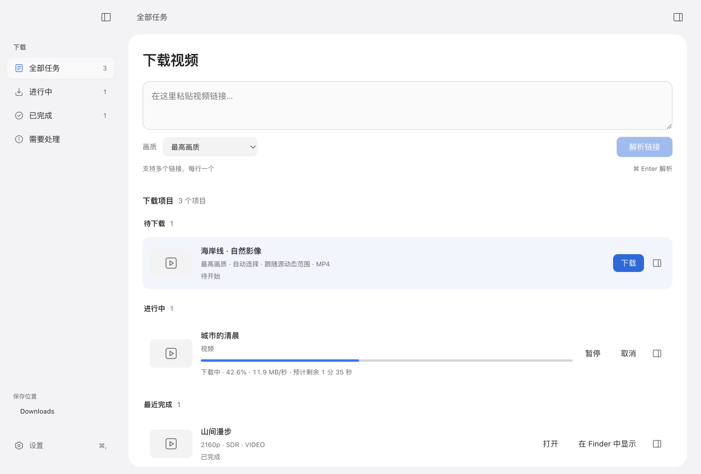
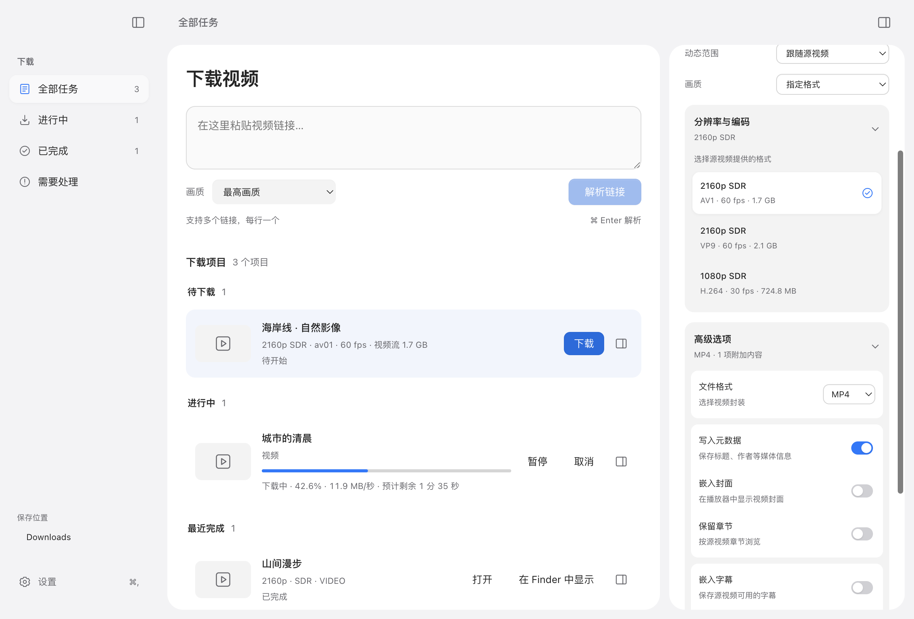

<p align="center">
  
</p>
<h1 align="center">MediaDrop</h1>
<p align="center">粘贴链接，选择画质，把视频留在本地。</p>
<p align="center">
  <a href="https://github.com/henry1786580051-lang/MediaDrop/releases/latest">下载最新版本</a> ·
  <a href="CHANGELOG.md">更新日志</a> ·
  <a href="https://github.com/henry1786580051-lang/MediaDrop/issues">反馈问题</a>
</p>
<p align="center">
  
  
  
  
</p>

MediaDrop 是一款面向 macOS 和 Windows 的视频、音频下载工具。支持批量解析链接、选择分辨率与编码、管理下载队列，以及保存字幕、章节和封面。桌面安装包自带后端与下载工具，无需另行安装 Python、Node.js 或 FFmpeg。



<sub>V1.2.0 界面预览，使用演示任务与实色外观；macOS 26 可启用原生 Liquid Glass。</sub>

## 下载与安装

当前版本：**[V1.2.0](https://github.com/henry1786580051-lang/MediaDrop/releases/tag/V1.2.0)**。

| 平台 | 适用设备 | 安装包 |
| --- | --- | --- |
| macOS | Apple Silicon（M1 及以后），macOS 12+ | [下载 DMG](https://github.com/henry1786580051-lang/MediaDrop/releases/download/V1.2.0/MediaDrop-1.2.0-macOS-arm64.dmg) |
| Windows x64 | 常见的 Intel / AMD 64 位电脑 | [下载 EXE](https://github.com/henry1786580051-lang/MediaDrop/releases/download/V1.2.0/MediaDrop.Setup.1.2.0.exe) |
| Windows ARM64 | ARM 电脑，需支持运行 x64 辅助进程 | [下载 ARM64 EXE](https://github.com/henry1786580051-lang/MediaDrop/releases/download/V1.2.0/MediaDrop.Setup.1.2.0.arm64.exe) |

[SHA-256 校验清单](https://github.com/henry1786580051-lang/MediaDrop/releases/download/V1.2.0/SHA256SUMS-V1.2.0.txt) · [历史版本](https://github.com/henry1786580051-lang/MediaDrop/releases)

**macOS：**打开 DMG，将 MediaDrop 拖入「应用程序」。当前不提供 Intel Mac 安装包。原生 Liquid Glass 需要 macOS 26；旧系统及减少透明度、高对比度环境使用实色界面。

**Windows：**运行对应架构的 EXE，按提示安装。ARM64 版本使用原生下载引擎，YouTube 令牌服务使用随包附带的 x64 辅助运行时。

<details>
<summary>首次打开时的系统安全提示</summary>

macOS 安装包使用 ad-hoc 签名，未进行 Apple 公证；Windows 安装包未进行商业代码签名，因此系统可能显示来源或信誉提示。请确认安装包来自本仓库 Release，并按需核对 SHA-256。

macOS 如阻止打开，可在确认来源后前往「系统设置 → 隐私与安全性」，查看应用对应的「仍要打开」选项。

</details>

## 开始下载

1. 在主页粘贴一个或多个链接，每行一个，点击 **解析链接**。Mac 可按 **⌘Enter**。
2. 解析完成后，点击任务旁的 **下载**。默认采用「最高画质」，实际下载遵循该任务当前设置。
3. 需要调整时，打开任务右侧的 **信息**：选择视频、音频或封面，调整画质、动态范围和文件格式。
4. 下载完成后，在 **已完成** 中搜索文件、打开文件或在 Finder 中定位。

主列表与详情栏使用相同的下载设置；修改选项后重试，也会采用新设置。

## 为下载而设计

| 视图 | 主要用途 |
| --- | --- |
| **全部任务** | 直接粘贴链接，按状态查看待下载、进行中和历史任务 |
| **进行中** | 关注进度、速度、剩余时间，管理排队和暂停的任务 |
| **已完成** | 浏览文件卡片，按视频标题或文件名搜索 |
| **需要处理** | 区分登录问题、下载失败和文件丢失，提供相应处理入口 |

- **批量处理**：一次解析多个链接，最多 4 路并行解析；可设置同时下载的任务数量。
- **队列与恢复**：暂停、继续、取消和重试；可恢复任务与历史记录独立保存。
- **文件管理**：打开文件、重新定位已移动文件；Mac 支持快速查看和拖到 Finder。
- **桌面体验**：深浅色、系统强调色、键盘操作与侧栏缓动；外观、密度和默认画质跨重启保存。
- **Mac 集成**：原生 Liquid Glass、Dock 进度、后台完成通知，以及下载期间防止应用因系统休眠而暂停。

## 画质、编码与高级选项



<sub>选项面板使用演示数据。实际格式、大小和帧率由源视频决定。</sub>

- **画质预设**：最高画质、均衡、节省空间、兼容优先；自动模式显示选择策略，不把推测的分辨率或大小当作最终结果。
- **精确选流**：保留同分辨率下不同编码与帧率，可选择源视频提供的 H.264、VP9、AV1 等视频流。
- **文件格式**：视频支持 MP4、MKV、WebM；音频输出 MP3；封面输出 JPG。
- **附加内容**：写入元数据、嵌入封面、保存可用字幕与章节，并设置字幕语言和 MP3 音质。
- **动态范围**：跟随源视频，或限定 HDR / SDR；下载后检查文件，标注可确认的 HLG、HDR10+、Dolby Vision、PQ HDR 或 SDR。

分辨率上限取决于源视频与平台实际提供的流，并非所有链接都有 4K 或 HDR。HDR 检查不进行 SDR 到 HDR 的转换；短采样无法证明整段视频始终包含动态元数据。不支持的封装组合会在选项中限制或提示，例如 WebM 不支持嵌入封面。

## YouTube 与工具更新

V1.2.0 新增 **YouTube SABR 增强引擎**及配套令牌组件，改善只能解析到 360P、无法取得高分辨率流的情况。在「设置 → 网络与登录」中可切换增强模式与标准模式，并配置浏览器 Cookie、cookies.txt 和代理。

| 组件 | 更新方式 |
| --- | --- |
| 标准 yt-dlp | 在「设置 → 更新与维护」中检查并独立更新 |
| YouTube 增强引擎与配套组件 | 随 MediaDrop 应用更新，单独显示版本与使用状态 |
| FFmpeg / FFprobe | 随应用安装包提供 |

如果仍提示登录认证，请在设置中选择已登录的受支持浏览器或 cookies.txt，再重新解析。可用格式仍受账户、地区、网络和平台变化影响，增强模式不能保证所有链接都可下载。

其他站点通过标准 yt-dlp 处理；支持范围以 [yt-dlp 站点列表](https://github.com/yt-dlp/yt-dlp/blob/master/supportedsites.md) 为准。

## 开发与自部署

<details>
<summary>运行桌面开发版</summary>

建议使用 Node.js 22.12+、Python 3.12，以及提供 `ffmpeg`、`ffprobe` 的 FFmpeg 安装。

```bash
git clone https://github.com/henry1786580051-lang/MediaDrop.git
cd MediaDrop
npm ci
python3 -m venv venv
source venv/bin/activate
pip install -r app/requirements.txt
npm start
```

Windows 使用对应的虚拟环境激活命令。源码运行增强模式前需要准备 `bundled-bin/youtube`；macOS 可运行 `bash scripts/prepare-youtube.sh`。未准备增强组件时，请在设置中使用标准模式。

</details>

<details>
<summary>运行 Web 服务或 Docker</summary>

Web 服务需要 Python、yt-dlp、FFmpeg 和 FFprobe，默认使用标准下载引擎。原生玻璃、Finder、系统文件选择器等功能仅在桌面版提供。

```bash
cd app
python3 -m venv venv
source venv/bin/activate
pip install -r requirements.txt
python3 app.py
```

浏览器访问 `http://localhost:8899`。

也可从仓库根目录构建 Docker 镜像；以下示例只向本机开放服务，并持久保存配置、任务记录和默认下载目录：

```bash
docker build -t mediadrop ./app
docker run --rm -p 127.0.0.1:8899:8899 \
  -e MEDIADROP_DATA_DIR=/data \
  -v mediadrop-data:/data mediadrop
```

</details>

<details>
<summary>测试与打包</summary>

```bash
npm test
npm run dist:mac
```

macOS 打包需要 Xcode 的 macOS 26 SDK 来构建原生玻璃组件；安装包在临时目录完成签名和校验后复制到 `dist/`。Windows x64 与 ARM64 由 [GitHub Actions](.github/workflows/build.yml) 构建，并检查下载工具、原生图像组件与令牌服务启动。

V1.2.0 通过 103 项后端测试及前端、桌面集成测试。完整发布记录见 [更新日志](CHANGELOG.md)。

</details>

## 项目结构

```text
MediaDrop/
├── main.js / preload.js       Electron 主进程与受限桌面接口
├── desktop-integration.js    菜单、窗口、通知与任务活动
├── native-glass.js / native/ AppKit Liquid Glass 桥接
├── app/
│   ├── app.py               下载服务、队列与配置接口
│   ├── job_store.py         SQLite 任务记录
│   ├── youtube_compat.py    YouTube 增强组件管理
│   ├── hdr_metadata.py      下载后动态范围核验
│   ├── templates/           页面结构
│   ├── static/              界面逻辑、样式与图标
│   └── tests/               后端回归测试
├── scripts/                 构建、组件校验与前端测试
└── .github/workflows/        跨平台测试与发布流程
```

## 致谢与许可

本项目基于 [reclip](https://github.com/averygan/reclip) 开发，使用 [yt-dlp](https://github.com/yt-dlp/yt-dlp)、[FFmpeg](https://ffmpeg.org/)、[Electron](https://www.electronjs.org/) 与 [Flask](https://flask.palletsprojects.com/)。YouTube 增强模式使用 [SABR 引擎分支](https://github.com/bashonly/yt-dlp/releases/tag/sabr) 和 [bgutil PO Token Provider](https://github.com/Brainicism/bgutil-ytdlp-pot-provider)。

仓库代码采用 [MIT License](LICENSE)；随包组件遵循各自许可证。请仅下载你拥有权利或已获授权保存的内容。
