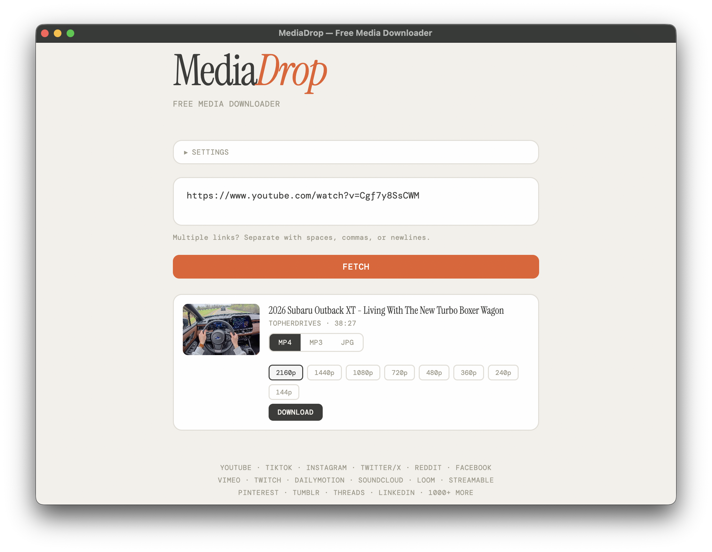

# 🎬 MediaDrop


一个简洁优雅的视频 / 音频下载器，支持 YouTube、TikTok、Instagram、Twitter/X 等 1000+ 网站，一键下载为 MP4、MP3 或 JPG。

> 本项目基于 [reclip](https://github.com/averygan/reclip) 开发，在此致谢。

> **👉 [下载桌面应用](https://github.com/henry1786580051-lang/MediaDrop/releases/latest)**，macOS / Windows 一键安装，开箱即用。

<p align="center">
  
</p>

---

## 📑 目录

- [功能特点](#-功能特点)
- [快速开始](#-快速开始) -- 下载桌面应用 / Web 版 / Docker
- [使用说明](#-使用说明)
- [支持网站](#-支持网站)
- [技术栈](#%EF%B8%8F-技术栈)
- [项目结构](#-项目结构)
- [免责声明](#-免责声明)
- [许可证](#-许可证)

---

## 🌟 功能特点

### 📥 核心功能

- **🔗 万能下载**：支持 1000+ 网站（基于 [yt-dlp](https://github.com/yt-dlp/yt-dlp)）
- **🎬 多格式输出**：MP4 视频 / MP3 音频 / JPG 缩略图，自由选择
- **📊 画质选择**：支持多种分辨率，最高 2160p (4K)
- **📦 批量下载**：一次粘贴多个 URL，自动去重，批量下载
- **⏸️ 下载控制**：实时进度追踪，支持暂停 / 恢复 / 取消
- **📂 自定义路径**：自由设置下载保存目录
- **🌐 智能代理**：自动检测系统代理，支持手动配置，代理不可达时自动降级直连
- **🔌 端口自适应**：默认端口 8899 被占用时自动切换到下一个可用端口，无需手动干预

### 🎨 界面设计

- 🃏 简洁现代的 Web UI，无需额外配置
- 📱 响应式布局，自适应不同窗口大小
- ⚡ 纯原生 HTML/CSS/JS，无框架依赖，零构建步骤

### 🖥️ 桌面应用

- 🍎 macOS / 🪟 Windows 原生桌面应用（Electron 封装）
- 🚀 一键启动，自动管理后端服务
- 📦 DMG / EXE 安装包，开箱即用

---

## 🚀 快速开始

### 方式一：下载桌面应用（推荐）

前往 [Releases](https://github.com/henry1786580051-lang/MediaDrop/releases/latest) 页面下载安装包：

| 平台 | 架构 | 文件 |
|------|------|------|
| **macOS** | Apple Silicon (M1+) | `MediaDrop-*-arm64.dmg` |
| **Windows** | x64（绝大多数电脑） | `MediaDrop.Setup.*.exe` |
| **Windows** | ARM64（Surface 等） | `MediaDrop.Setup.*.arm64.exe` |

> 💡 **不确定用哪个版本？**
> - **Mac 用户**：下载 `.dmg` 文件（仅支持 Apple Silicon / M1+）
> - **Windows 用户**：下载不带 `arm64` 的 `.exe`（x64，兼容绝大多数 Windows 电脑）

<details>
<summary><strong>🍎 macOS 安装说明</strong></summary>

1. 下载 `MediaDrop.dmg` 文件
2. 双击打开 DMG，将 MediaDrop 拖入 Applications 文件夹
3. 在启动台或 Applications 中找到 MediaDrop 并打开

⚠️ 首次打开可能提示"无法验证开发者"，请在 **系统设置 → 隐私与安全性** 中点击「仍要打开」。

</details>

<details>
<summary><strong>🪟 Windows 安装说明</strong></summary>

1. 下载对应架构的 `.exe` 安装包
2. 双击运行，按提示完成安装
3. 从开始菜单或桌面快捷方式启动 MediaDrop

</details>

### 方式二：Web 版（开发者）

<details>
<summary><strong>🍎 macOS 从源码运行</strong></summary>

#### 第一步：安装依赖

```bash
brew install yt-dlp ffmpeg python3
```

#### 第二步：克隆并运行

```bash
git clone https://github.com/henry1786580051-lang/MediaDrop.git
cd MediaDrop/app
./start.sh
```

浏览器打开 **http://localhost:8899** 即可使用。

</details>

<details>
<summary><strong>🐧 Linux 从源码运行</strong></summary>

#### 第一步：安装依赖

```bash
sudo apt install python3 python3-pip yt-dlp ffmpeg
```

#### 第二步：克隆并运行

```bash
git clone https://github.com/henry1786580051-lang/MediaDrop.git
cd MediaDrop/app
pip install flask yt-dlp
python3 app.py
```

浏览器打开 **http://localhost:8899** 即可使用。

</details>

### 方式三：Docker

<details>
<summary><strong>🐳 Docker 运行</strong></summary>

```bash
git clone https://github.com/henry1786580051-lang/MediaDrop.git
cd MediaDrop/app
docker build -t mediadrop .
docker run -p 8899:8899 mediadrop
```

浏览器打开 **http://localhost:8899** 即可使用。

</details>

---

## 📖 使用说明

1. **📋 粘贴链接**：将一个或多个视频 URL 粘贴到输入框中
2. **🎯 选择格式**：选择 **MP4**（视频）、**MP3**（音频）或 **JPG**（缩略图）
3. **🔍 获取信息**：点击 **Fetch** 按钮，加载视频信息和缩略图
4. **📊 选择画质**：如果可用，选择所需的分辨率
5. **⬇️ 开始下载**：点击单个视频的 **Download** 按钮，或 **Download All** 批量下载

---

## 🌐 支持网站

支持 [yt-dlp 支持的所有网站](https://github.com/yt-dlp/yt-dlp/blob/master/supportedsites.md)，包括但不限于：

| 类别 | 网站 |
|------|------|
| **视频** | YouTube, TikTok, Instagram, Twitter/X, Reddit, Facebook, Vimeo, Twitch, Dailymotion, Bilibili |
| **社交** | Tumblr, Threads, LinkedIn, Pinterest, Snapchat |
| **教育** | Loom, Streamable, Coursera, TED |
| **音乐** | SoundCloud, Bandcamp, Spotify (部分) |
| **其他** | 1000+ 更多网站... |

> 💡 完整支持列表请参考 [yt-dlp 支持站点文档](https://github.com/yt-dlp/yt-dlp/blob/master/supportedsites.md)。

---

## 🛠️ 技术栈

| 技术 | 用途 |
|------|------|
| [Python 3.8+](https://www.python.org/) | 后端语言 |
| [Flask 3.0](https://flask.palletsprojects.com/) | Web 框架 |
| [yt-dlp](https://github.com/yt-dlp/yt-dlp) | 视频下载引擎 |
| [ffmpeg](https://ffmpeg.org/) | 音视频转码 |
| [Electron 33](https://www.electronjs.org/) | 桌面应用封装 |
| HTML / CSS / JavaScript | 前端界面（原生，无框架） |

---

## 📁 项目结构

```
MediaDrop/
├── main.js                    # Electron 主进程
├── preload.js                 # Electron 预加载脚本
├── package.json               # Node.js 配置与构建脚本
├── app/                       # Flask 后端 + 前端
│   ├── app.py                 # Flask 服务端（~150 行）
│   ├── start.sh               # 一键启动脚本
│   ├── requirements.txt       # Python 依赖
│   ├── Dockerfile             # Docker 构建文件
│   ├── templates/
│   │   └── index.html         # 前端界面（单文件）
│   ├── static/
│   │   └── favicon.svg        # 图标
│   └── assets/
│       ├── preview-mp3.png    # 预览截图
│       └── preview.mp4        # 预览视频
└── README.md                  # 项目说明
```

---

## ⚠️ 免责声明

本工具仅供个人学习和研究使用。请遵守当地法律法规以及所下载平台的服务条款。开发者不对本工具的任何滥用行为负责。

---

## 📄 许可证

[MIT License](LICENSE)
